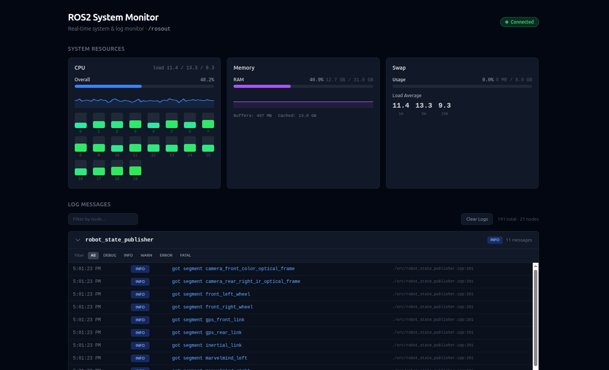

# ros2_system_monitor

A real-time system monitoring dashboard for ROS 2. It provides a web-based UI that displays live CPU, memory, swap, and load average statistics alongside a scrollable `/rosout` log viewer — all served from a single ROS 2 node.




---

## Features

| Feature | Details |
|---|---|
| **System stats API** | CPU (overall + per-core), memory, swap, load average — sampled every second from `/proc/` |
| **Live log viewer** | Subscribes to `/rosout` via [rosbridge](https://github.com/RobotWebTools/rosbridge_suite) WebSocket and streams DEBUG → FATAL messages in real time |
| **Self-contained HTTP server** | A single C++ ROS 2 node serves both the JSON API (`/api/system`) and the static frontend on one port |
| **Next.js + Tailwind UI** | Responsive dark-themed dashboard with 60-second rolling CPU & memory history graphs |
| **Configurable port** | Change the HTTP port via a ROS parameter or launch argument (default `2525`) |

## Architecture

```
┌─────────────────────────────────────────────────────────┐
│  Browser (http://hostname:2525)                         │
│  ┌───────────────┐  ┌────────────────────────────────┐  │
│  │ System Stats   │  │ /rosout Log Viewer             │  │
│  │ (polls /api/   │  │ (WebSocket → rosbridge :9090)  │  │
│  │  system)       │  │                                │  │
│  └───────┬───────┘  └──────────────┬─────────────────┘  │
└──────────┼─────────────────────────┼────────────────────┘
           │ HTTP GET                │ ws://
           ▼                         ▼
   ┌──────────────┐         ┌──────────────────┐
   │ http_server  │         │ rosbridge_server  │
   │ (C++ node)   │         │ (WebSocket node)  │
   │  :2525       │         │  :9090            │
   └──────────────┘         └──────────────────┘
           │                         │
           └─── /proc/stat ──────────┘──── ROS 2 graph ───
               /proc/meminfo
               /proc/loadavg
```

## Prerequisites

- **ROS 2** (Humble, Iron, or Jazzy)
- **colcon** build tool
- **Node.js ≥ 18** and **npm** (used at build time to compile the frontend)
- **cpp-httplib** development headers

### Install system dependencies (Ubuntu)

```bash
sudo apt update
sudo apt install ros-${ROS_DISTRO}-rosbridge-server libcpp-httplib-dev nodejs npm
```

> **Note:** If your distro's Node.js is too old, use [nvm](https://github.com/nvm-sh/nvm) to install a recent version.

## Building

Clone into a colcon workspace and build:

```bash
mkdir -p ~/ros2_ws/src
cd ~/ros2_ws/src
git clone https://github.com/namo-robotics/ros2_system_monitor.git

cd ~/ros2_ws
source /opt/ros/${ROS_DISTRO}/setup.bash
colcon build --packages-select ros2_system_monitor
source install/setup.bash
```

The build automatically runs `npm install && npm run build` inside the `web/` directory and installs the static export to `share/ros2_system_monitor/web`.

## Usage

### Launch (recommended)

The included launch file starts both **rosbridge_websocket** and the **http_server** node:

```bash
source ~/ros2_ws/install/setup.bash
ros2 launch ros2_system_monitor monitor.launch.py
```

Then open **http://localhost:2525** in a browser.

#### Changing the port

```bash
ros2 launch ros2_system_monitor monitor.launch.py port:=8080
```

### Run the node directly

If you already have rosbridge running separately:

```bash
ros2 run ros2_system_monitor http_server --ros-args -p port:=2525
```

### Development mode

A helper script runs the Next.js dev server (with hot-reload on port 3000), the C++ HTTP server (API on port 2525), and rosbridge side-by-side:

```bash
# Build once first
colcon build --packages-select ros2_system_monitor
source install/setup.bash

./dev.sh
# → Web UI:    http://localhost:3000  (hot-reload)
# → Stats API: http://localhost:2525/api/system
# → rosbridge: ws://localhost:9090
```

## API Reference

### `GET /api/system`

Returns a JSON object with current system statistics:

```json
{
  "cpu_percent": 12.3,
  "cores": [
    { "name": "cpu0", "percent": 8.1 },
    { "name": "cpu1", "percent": 16.5 }
  ],
  "memory": {
    "total_mb": 16384.0,
    "used_mb": 8192.0,
    "free_mb": 8192.0,
    "buffers_mb": 256.0,
    "cached_mb": 4096.0,
    "percent": 50.0
  },
  "swap": {
    "total_mb": 8192.0,
    "used_mb": 0.0,
    "percent": 0.0
  },
  "load_avg": {
    "one": 0.5,
    "five": 0.3,
    "fifteen": 0.2
  }
}
```

## Project Structure

```
ros2_system_monitor/
├── CMakeLists.txt              # ament_cmake build + frontend build
├── package.xml                 # ROS 2 package manifest
├── dev.sh                      # Development helper script
├── launch/
│   └── monitor.launch.py       # Launches rosbridge + http_server
├── src/
│   └── http_server.cpp         # C++ node: API server + static file server
└── web/                        # Next.js frontend
    ├── app/
    │   ├── layout.tsx
    │   └── page.tsx            # Dashboard page
    ├── components/
    │   ├── ConnectionBadge.tsx  # rosbridge connection indicator
    │   ├── LogViewer.tsx        # /rosout log table
    │   ├── NodeSection.tsx      # Per-node log grouping
    │   └── SystemStatsPanel.tsx # CPU / memory / swap / load cards
    ├── hooks/
    │   ├── useRos.ts           # rosbridge WebSocket + /rosout subscription
    │   └── useSystemStats.ts   # Polls /api/system every second
    └── types/
        ├── ros.ts              # ROS message types
        └── system.ts           # System stats types
```

## ROS 2 Interfaces

### Parameters

| Node | Parameter | Type | Default | Description |
|---|---|---|---|---|
| `static_http_server` | `port` | `int` | `2525` | HTTP server listen port |

### Topics subscribed (via rosbridge in the browser)

| Topic | Type | Purpose |
|---|---|---|
| `/rosout` | `rcl_interfaces/msg/Log` | Aggregated log messages from all nodes |

### Dependencies

| Package | Purpose |
|---|---|
| `rclcpp` | ROS 2 C++ client library |
| `rosbridge_server` | WebSocket bridge for the browser |
| `libcpp-httplib-dev` | Header-only C++ HTTP server library |

---

## License

This project is licensed under the MIT License — see the [LICENSE](LICENSE) file for details.